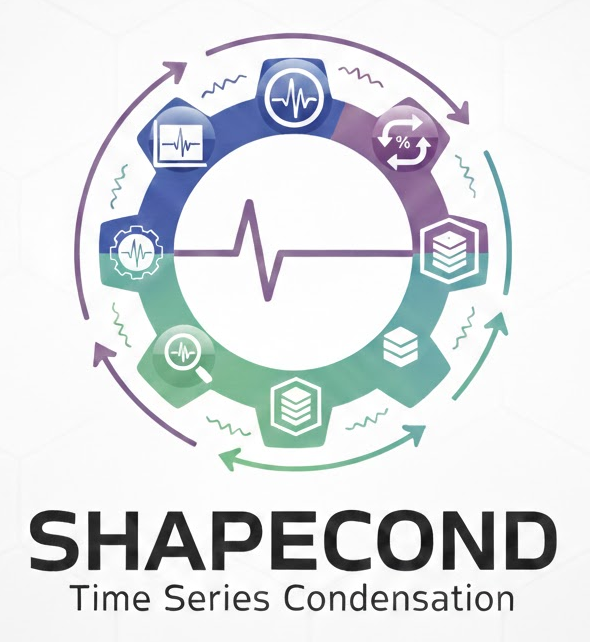
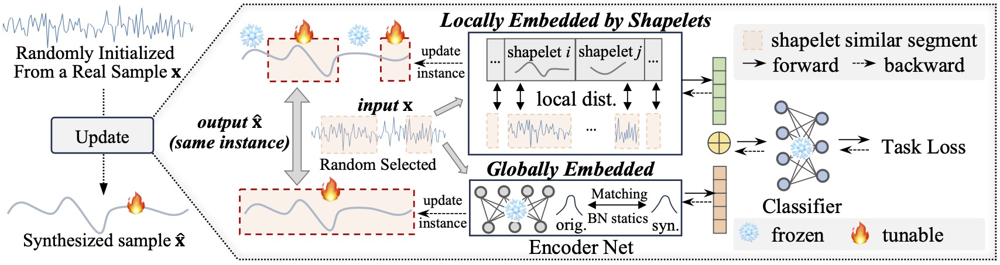

<div align="center">
  

  # ShapeCond: Fast Shapelet-Guided Dataset Condensation
  
  **Official PyTorch Implementation**

  [](https://github.com/lunaaa95/ShapeCond/blob/master/LICENSE)
  [](https://arxiv.org/abs/2602.09008)&nbsp; 
  [](https://www.python.org/downloads/release/python-3.90/)
  [](https://github.com/Lunaaa95/ShapeCond)

  ---

  <p align="center">
    <a href="#paper">✈️ Paper</a> • 
    <a href="#get-started">😊 Get Started</a> • 
    <a href="#run">🎈 Run</a> • 
    <a href="#results">✨ Results</a> • 
    <a href="#citation">📜 Citation</a>
  </p>
</div>

<a name="paper"></a>
## ✈️ Our Paper

Dataset condensation reduces large training sets into compact, informative subsets, but existing methods, mostly designed for images, fail to capture the temporal structures critical in time series data. 
We propose ShapeCond, an efficient framework that leverages shapelet-guided optimization to synthesize compact datasets while jointly preserving both local discriminative patterns and global temporal structures. 
ShapeCond is highly efficient—up to 29× faster than the prior state-of-the-art CondTSC, and up to 10,000× faster than naïve shapelet-based methods on long sequences (e.g., the Sleep dataset with 3,000 timesteps). By balancing local and global information, ShapeCond consistently outperforms all existing state-of-the-art time series dataset condensation methods.
<div align="center">
  <figure>
    
  <figcaption><br>Shapelet-guided optimization for Synthesizing Condensed Dataset.</figcaption>
  </figure>
</div>

<a name="get-started"></a>
## 😊 Get Started

### 1. Download Code

```bash
git clone https://github.com/lunaaa95/ShapeCond.git
cd ShapeCond
```

### 2. Prepare Environment

**Python version:** 3.9.21

Install required packages:

```bash
pip install -r requirements.txt
```

### 3. Download Datasets

All datasets should be placed in the `./data` directory. Our experiments are conducted on seven time series classification datasets: **HAR**, **Electric**, **Sleep**, **TwoPatterns**, **FacesUCR**, **Tiselac**, and **Pedestrian**.

- **HAR**, **Electric**, and **Sleep** are downloaded by following the instructions provided in the [TimeSeriesCond repository](https://github.com/zhyliu00/TimeSeriesCond) and are preprocessed using `preprocessing.py`.

- **TwoPatterns**, **FacesUCR**, and **Tiselac** are obtained via `sktime.datasets`. Run `uea.py` to automatically download and preprocess these datasets.

- **Pedestrian** is downloaded from the [Monash Scalable Time Series Evaluation Repository](https://huggingface.co/monster-monash) and is preprocessed using `preprocessing.py`.


<a name="run"></a>
## 🎈 Run

Run experiments using the following command:

```
./scripts/<framework>/<dataset>.sh
```

Examples:

```
./scripts/CNNBN/har.sh

./scripts/CNNBN/Pedestrian.sh

./scripts/Transformers/electric.sh
```

Fast shapelet discovery is automatically triggered the first time a dataset is processed, and the extracted shapelets are saved in the `sc/` directory for reuse. This significantly reduces computational cost, enabling shapelet extraction on large-scale datasets. Pre-extracted shapelets are also provided in this repository for convenience.

<a name="results"></a>
## ✨ Main Results

| Dataset | Ratio(%) | SPC | Random | Herding | K-Center | DC | DSA | MTT | SRe²L | CondTSC | ShapeCond | Full |
|--------|----------|-----|--------|---------|----------|----|-----|-----|-------|----------|-----------|------|
| FacesUCR | 1 | 1 | 31.63 | 39.87 | 40.76 | 58.23 | 56.46 | 68.47 | 59.30 | 67.75 | **79.26** |  |
|  | 5 | 5 | 70.82 | 64.14 | 68.82 | 75.81 | 76.98 | 86.96 | 92.78 | 88.69 | **93.26** | 97.12 |
|  | 10 | 10 | 77.73 | 77.95 | 77.51 | 80.06 | 84.66 | 92.42 | 94.09 | 92.65 | **95.10** |  |
| TP | 0.3 | 1 | 24.91 | 24.00 | 24.00 | 33.49 | 33.14 | 42.79 | 33.42 | 43.79 | **45.95** |  |
|  | 3.2 | 10 | 39.84 | 34.82 | 43.25 | 49.18 | 50.24 | 75.35 | 77.08 | 78.40 | **90.94** | 99.95 |
| HAR | 0.1 | 1 | 52.58 | 40.59 | 38.11 | 52.50 | 53.80 | 60.54 | 60.12 | 62.45 | **76.44** |  |
|  | 0.5 | 5 | 54.62 | 62.43 | 64.10 | 64.90 | 66.47 | 81.63 | 79.69 | 82.20 | **89.10** | 95.73 |
|  | 1.0 | 10 | 62.27 | 65.32 | 66.51 | 69.65 | 72.07 | 90.06 | 84.83 | 82.68 | **92.08** |  |
| Electric | 0.1 | 1 | 39.29 | 39.55 | 42.86 | 45.12 | 46.06 | 52.06 | 49.95 | 45.32 | **54.72** |  |
|  | 0.4 | 5 | 38.44 | 48.93 | 46.79 | 53.74 | 56.91 | 60.03 | 62.53 | 54.24 | **65.38** | 75.20 |
|  | 0.9 | 10 | 46.48 | 58.96 | 47.78 | 55.51 | 55.34 | 62.89 | 63.87 | 56.52 | **68.30** |  |
| Sleep | 0.2 | 10 | 44.54 | 42.30 | 32.09 | 32.16 | 32.10 | 35.77 | 29.43 | 46.16 | **47.08** |  |
|  | 1.0 | 50 | 52.62 | 45.23 | 50.31 | 42.35 | 42.67 | 54.28 | 63.86 | 60.27 | **68.21** | 75.53 |
| Tiselac | 0.11 | 10 | 59.85 | 63.24 | 64.03 | 61.58 | 63.41 | 62.88 | 47.42 | 61.49 | **72.83** |  |
|  | 0.23 | 20 | 65.17 | 67.00 | 63.26 | 62.28 | 68.82 | 68.86 | 50.55 | 63.18 | **75.37** | 80.60 |
|  | 0.56 | 50 | 71.97 | 73.71 | 72.54 | 69.71 | 70.02 | 72.64 | 61.04 | 70.52 | **77.18** |  |
| Pedestrian | 0.05 | 1 | 6.98 | 4.29 | 4.95 | 3.77 | 6.77 | 6.40 | 8.92 | 10.29 | **10.78** |  |
|  | 0.27 | 5 | 11.56 | 10.55 | 10.24 | 5.53 | 9.29 | 12.68 | 17.50 | 17.20 | **25.30** | 31.37 |
|  | 0.54 | 10 | 11.85 | 15.99 | 13.52 | 7.18 | 12.56 | 15.09 | 20.52 | 17.89 | **27.69** |  |
|  | 1.08 | 20 | 13.10 | 16.22 | 21.49 | 9.81 | 16.44 | 18.43 | 27.41 | 21.00 | **30.00** |  |

<a name="citation"></a>
## 📜 Citation

```
@misc{peng2026shapecondfastshapeletguideddataset,
      title={ShapeCond: Fast Shapelet-Guided Dataset Condensation for Time Series Classification}, 
      author={Sijia Peng and Yun Xiong and Xi Chen and Yi Xie and Guanzhi Li and Yanwei Yu and Yangyong Zhu and Zhiqiang Shen},
      year={2026},
      eprint={2602.09008},
      archivePrefix={arXiv},
      primaryClass={cs.LG},
      url={https://arxiv.org/abs/2602.09008}, 
}
```
